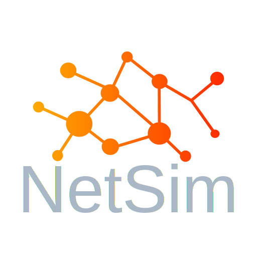

<p align="center">
  
</p>

# NetSim - The educational Network Simulation

[](https://app.codacy.com/gh/Filan-glitch/NetSim/dashboard?utm_source=gh&utm_medium=referral&utm_content=&utm_campaign=Badge_grade)

🌐 **Net**work **Sim**ulation is a C++ based project using the Qt framework that represents a simulation of a network. The project aims to model and simulate basic network structures such as hosts, routers, processes, and network layers with their protocols. It provides a visual graphical user interface (GUI) to visualize the network topology and allows interaction with the simulated network components.

## Project Features

🚀 The Network Simulation project includes the following main features:

1. **Visualization of Network Topology**: The project visualizes the network topology in a graphical user interface where hosts, routers, and their connections are represented visually. This provides a clear representation of the simulated network.

1. **Creation and Configuration of Network Components**: It provides functions to add, remove, and configure hosts, routers, and processes within the network. Users can set parameters such as IP addresses, hostnames, port numbers, etc.

1. **Data Packet Simulation**: The project enables the simulation of data traffic between network components. Users can send data packets from one host to another and trace the path the packet takes through the network.

1. **Protocol Support**: It implements basic network protocols such as IP (Internet Protocol), TCP (Transmission Control Protocol), and UDP (User Datagram Protocol). This allows the use of different protocols for communication between network components.

1. **Logging and Error Handling**: The project provides logging functionality to capture events and errors during the network simulation. This facilitates error handling and debugging.

## Technologies Used

🛠️ The Network Simulation project is built using the following technologies and tools:

- **C++**: The main programming language used for implementing the network simulation.
- **Qt Framework**: The framework is used to create the user interface and enable GUI interactions.

## Installation and Execution

🔧 To run the Network Simulation project on your local system, please follow these steps:

1. Clone the GitHub repository:

   ```bash
   git clone https://github.com/Filan-glitch/NetSim.git
   ```

1. Install any required dependencies and configurations as instructed in the project documentation.

1. Build the project using the QMake.

1. Launch the application and start simulating the network.

## Contribution and Feedback

🤝 Contributions, suggestions, and feedback are welcome! If you would like to make improvements to the project or have found any issues, please open an issue or submit a pull request.

## Resources

📚 Here are some useful resources related to network simulation:

- [Qt Documentation](https://doc.qt.io/): Official documentation for the Qt framework.
- [Computernetzwerke : Der Top-Down-Ansatz](https://books.google.de/books?id=36vPdcV78YkC&printsec=copyright&hl=de#v=onepage&q&f=false): Literature resource explaining the network structure and important protocols.
